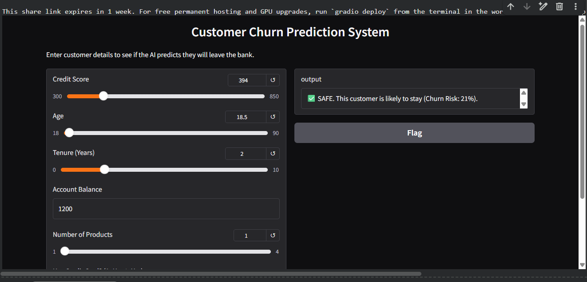

# Customer Churn Prediction System (Task 2)

## 📌 Project Overview
This project is a Machine Learning application designed to predict whether a bank customer will leave (churn) or stay. It uses a **Random Forest Classifier** to analyze customer behavior and provides an interactive web interface for real-time predictions.

## 🚀 Features
* **Machine Learning:** Trained on customer data (Age, Credit Score, Balance, etc.).
* **Model:** Random Forest Classifier (Scikit-Learn).
* **Interface:** Interactive Web App built with **Gradio**.
* **Output:** Returns a "Safe" or "Risk" alert with a probability percentage.

## 📸 Demo
Here is the interactive dashboard in action:




## 🛠️ How to Run
1. Install dependencies:
   ```bash
   pip install -r requirements.txt
